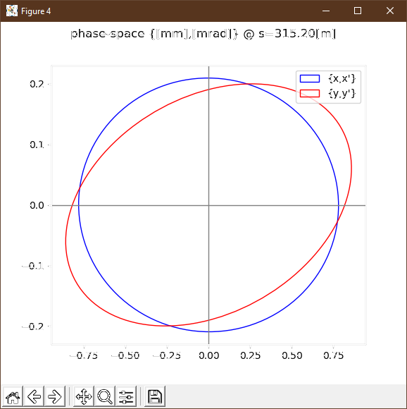
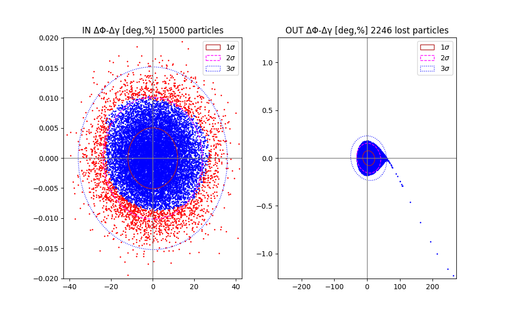
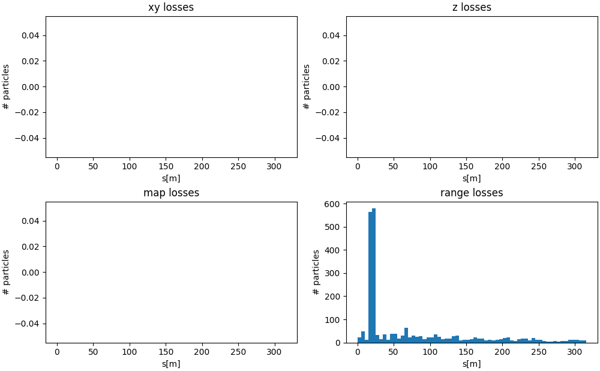

[pruduced with](trackerIN_smh27-12.yml)
* Win = 6. Mev
* DW2W = 8.e-3 (aka DT/T)
* DPHI0 = 12. deg

Note: 
* ERROR in plot. W should be w.
* W (aka T) is kinetic energy and minor w is 
Wrangler's w which is Dgamma=DW/m0c2 (aka DT/m0c2)

Seen are plots of a tracker run w/o aperture checks. 
* On the left in {z-Dp/p} coordinates,
* on the right in {Dphi-w} coordinates.

w=(DW/W)*(W/mc2)=8.e-3 * 6/938 = 51.2e-6 = 51.2e-4 % = 0.00512 %

On the IN-plot: 
* The statistical 1-sigma of the distribution in energy spread w is at about 0.005%, - therefore correct!
* The statistical 1-sigma of the distribution in phase spread is about +-12deg - therefore correct!

On the OUT-plot:
* A nice hokeystick - as expected!
* The statistical distribution in energy spread is about 2-sigma - as expected.
* The energy spread increased about a factor 18 - expected?
* The statistical phase spread stays within about a factor 1 to 1.5 the same 
but goes beyond 3 sigma on positve phase differences (lagging particles). - expected?

## Next:

On the IN-plot:
* sigmax = sqrt(eps-x * beta-x) = sqrt(1e-6 * 0.92) = 1e-3*sqrt(0.92) = 0.96e-3=0.96 mm.
* statistical 1-sigmax at about 1 mm - expected!
* sigmaxp = 1e-3 / sqrt(0.92) = 1.04 mrad.
* statistical 1-sigmaxp at about 1 mrad - expected!
* similar check for sigmay and sigmayp - as expected!
On the OUT-plot:
* minimal increase in sigmax - expected?
* sigmaxp reduced by about a factor 1/3 - expected (adiabatic damping!)

OUT ellipses from simu
* Size of envelope ellipses similar to size of statistical ellipses - expected!
* Correlation, i.e. alfa not the same between envelope- and statistical ellipses - expected? not really.

## Next:
* python tracker.py --file doc\new_hokeystick\trackerIN_smh27-12.yml --losses --p 15000

